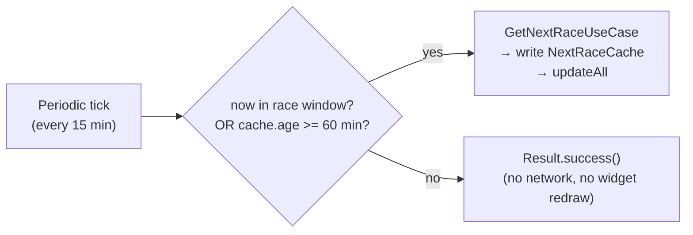
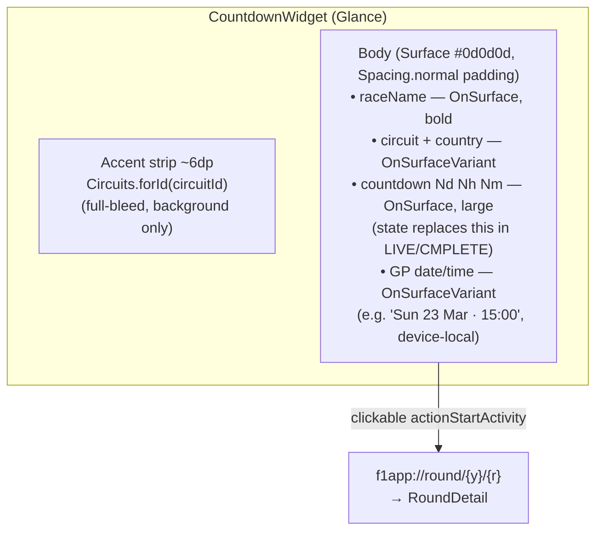

## Decision

Pins the Countdown widget's concrete behavior, sizing, refresh contract, and
visual layout. All decisions apply to the **Glance** widget scoped by ticket 06
and the `NextRaceCache` + `CountdownWorker` from ticket 03. This ticket adds no
new tech — it resolves the five open spec questions raised when 06 closed.

### 1. Refresh cadence & accuracy — adaptive, one periodic job

One `PeriodicWorkRequest` at the **15-min WorkManager floor** (can't go lower).
A gate at the top of `CountdownWorker.doWork()` decides whether the fetch +
`updateAll` actually runs this cycle:

- **Race window** = `[cached FP1_start, cached race_start + 3h]`. Both
  timestamps already live in `NextRaceCache` (ticket 03 stores the full session
  schedule). This is effectively "Friday → Sunday end-of-race" for a standard
  weekend, derived from real session timestamps rather than a calendar guess.
- **Inside the window:** fetch every tick → 15-min freshness. Keeps LIVE-state
  detection and the post-race "next" flip reasonably prompt.
- **Outside the window:** fetch only when the cache is ≥ 60 min old → effectively
  hourly polling. The next-race timestamp barely moves between weekends, so
  hourly is plenty; 15-min network calls when nothing changes is waste.
- **No second WorkManager spec, no dynamic `setNext` reschedule** — one
  `PeriodicWorkRequest`, one branch in `doWork`. `ponytail:` if the 60-min gate
  ever feels like it's reinventing scheduling, revisit `setNext` then.
- **Visible tick:** no per-second / per-minute chronometer on the widget. The
  displayed countdown is recomputed from `NEXT_RACE_START_MILLIS` at each render
  (worker-driven `updateAll` + system-driven widget refreshes). Displayed
  precision = **days / hours / minutes**; minute drift between renders is
  accepted. The "1s client-side tick" referenced in ticket 03's summary, if it
  lives anywhere, is the in-app Homepage favorite-next-GP card, **not** the
  widget.
- **No exact-AlarmManager / Handler near green flag for v1.** 15-min-stale is
  fine for a glanceable "days until" widget; near lights-out the user is
  almost always already in-app. `ponytail:` revisit only if a real user
  reports the LIVE-state 15-min lag.

### 2. Live-race handling — window check at render time

`provideGlance` computes widget state from `now` vs the cached race window
(`start` = `NEXT_RACE_START_MILLIS`, assumed race duration = 3h, matching the
worker's window):

| Condition | Display | Deep link |
|---|---|---|
| `now < start` | countdown (`Nd Nh Nm`) + GP date/time | on |
| `start ≤ now < start + 3h` | **"LIVE NOW"** (circuit-accent color) + GP date/time | on |
| `now ≥ start + 3h` | **"RACE COMPLETE"** transient + GP date/time (shown until next worker fetch swaps to the new next race) | on |

- The widget never renders race *results* — tap → `RoundDetail` (ticket 05)
  where results live. "RACE COMPLETE" is a ~15-min transient until the next
  worker tick flips `NEXT_RACE_*` to the following GP.
- 3h assumed race duration is a `ponytail:` constant — real races run ~2h,
  red-flags rarely push 3h; revisit if a wet race overruns and the widget
  flips to "RACE COMPLETE" early.

### 3. Empty / error states

- **Off-season** — worker detects an empty `/current/next` response and writes
  a sentinel `NEXT_RACE_START_MILLIS == 0L`. Widget shows **"Season over"** in
  `OnSurfaceVariant`, deep link **suppressed** (no valid round to open).
- **No cache + sync failure** (first cold launch, no network): widget shows
  **"No race data — tap to retry"**; tap enqueues a one-shot
  `OneTimeWork` expedited `CountdownWorker` (no deep link).
- **Cache set + sync failure** (ticket 03's invariant — leave the cached value,
  don't clear): widget keeps showing the stale cached countdown/date, never
  blanks. Stale-but-present beats empty.

### 4. Deep-link target — reaffirms 05, adds suppressed states

- Deep link = `f1app://round/{year}/{round}` → `RoundDetail` (ticket 05).
- **Suppressed** in: off-season (`NEXT_RACE_START_MILLIS == 0L`) and no-cache
  states — no valid round to open, so no `clickable` on the widget content.
- LIVE / countdown / race-complete states all deep-link to `RoundDetail`.

### 5. Visual contract — dark-only, circuit-accented

Single dark-only layout. Reuses 02's tokens and 06's Glance binding (colors
imported directly from `ui/theme/Color.kt` — Glance does not consume Compose
`MaterialTheme`):

- **Background** `Surface` (#0d0d0d). Dark-only invariant re-affirmed; no light
  variant of the widget.
- **Accent strip** ~6dp, full-bleed, `Circuits.forId(circuitId)`. Per the
  Circuits contract (02): saturated colors are **backgrounds only, never body
  text on dark**. The "LIVE NOW" label borrows the same accent as text *over*
  the dark body area only because it's a short label — still paired visually
  with the strip, not used for body copy.
- **Body text** OnSurface / OnSurfaceVariant per role above.
- **GP date/time** formatted from `NEXT_RACE_START_MILLIS` (an instant) in
  device-local time (e.g. `Sun 23 Mar · 15:00`). Shown in countdown, LIVE, and
  race-complete states. Hidden in off-season / no-cache states (no race).
- **Padding** from `Spacing.normal` (16dp); accent strip full-bleed (no
  padding).
- **No icon / launcher-art asset for v1** — text-only. `ponytail:` add only
  when someone wants flair.

### Sizing (AppWidgetProviderInfo)

From the boxbox-club design, locked here for the `res/xml/` provider info:

| attr | value |
|---|---|
| `minWidth` | 115dp |
| `minHeight` | 256dp |
| `maxResizeWidth` | 130dp |
| `maxResizeHeight` | 624dp |
| `minResizeWidth` | 56dp |
| `minResizeHeight` | 120dp |
| `resizeMode` | `horizontal\|vertical` |
| `configure` | none (no config activity) |
| `updatePeriodMillis` | `0` (Glance re-render driven by worker `updateAll`, not the system poller) |
| `previewLayout` | Glance preview composables (set at implementation time) |

## Rationale

- **Adaptive cadence over fixed 15-min:** outside race weekends, the next-race
  row doesn't change for days; hourly polling is plenty and 15-min network
  calls would be pure waste. During race weekends the "next" flips (FP → qualy
  → race → following GP) and LIVE-state detection matters, so 15-min is the
  floor there. One `PeriodicWorkRequest` + a gate is simpler than two specs or
  dynamic rescheduling — the user's "effectively hourly outside Fri–Sun" with
  no extra WorkManager machinery.
- **Render-time window check (no live chronometer):** Glance's update model is
  worker/system-driven, not a ticking clock. Computing LIVE/COMPLETE from
  `now` vs cached start at each render fits Glance instead of fighting it
  (ticket 06 already concluded no live chronometer).
- **Stale > empty:** keeping the last good cached value on sync failure (03's
  invariant) means a glanceable widget never blanks mid-season; "Season over"
  is the only true empty state and it's a real season boundary, not an error.
- **GP date/time alongside the countdown:** a widget that shows "2d 4h" but
  not *when* the race is forces a tap for the most basic context. The instant
  is already cached — showing it local-format is one `Text`.
- **Circuit-accent strip reuses 02's `Circuits` palette** — no new color
  invented for the widget; the per-track brand color is the widget's identity,
  matching how the app uses Circuits elsewhere.

## Out of scope

- **Per-second / per-minute live tick on the widget** — no Glance chronometer;
  render-time recompute only. The in-app Homepage card may tick faster; that's
  a Homepage concern, not this ticket.
- **Exact-AlarmManager near green flag / race-start notifications** — not in
  v1; `ponytail:` revisit if LIVE-state lag is reported.
- **Widget preview assets / launcher art** — text-only v1; flair is a later
  fresh decision.
- **Race results on the widget** — never; results live in `RoundDetail`.

## Reference

- [06-widget-technology.md](06-widget-technology.md) — Glance tech, `provideGlance`
  shape, `clickable(actionStartActivity(intent))` deep-link binding.
- [03-data-layer-and-refresh.md](03-data-layer-and-refresh.md) — `NextRaceCache`
  typed keys + session schedule, `CountdownWorker` 15-min floor, leave-cached-on-failure.
- [05-navigation-and-deep-links.md](05-navigation-and-deep-links.md) —
  `f1app://round/{year}/{round}` → `RoundDetail` deep-link contract.
- [02-design-system-theme.md](02-design-system-theme.md) — `Surface` /
  `OnSurface` / `OnSurfaceVariant` / `Circuits.forId` / `Spacing` tokens.
- [../../map.md](../map.md) — Countdown-only widget scope.
- [../../../design-system/theme.md](../../../design-system/theme.md) — token
  → `darkColorScheme()` mapping, Circuits contract (accents = backgrounds).
- [../../../terminology.md](../../../terminology.md) — Countdown widget,
  NextRaceCache, CountdownWorker definitions.
