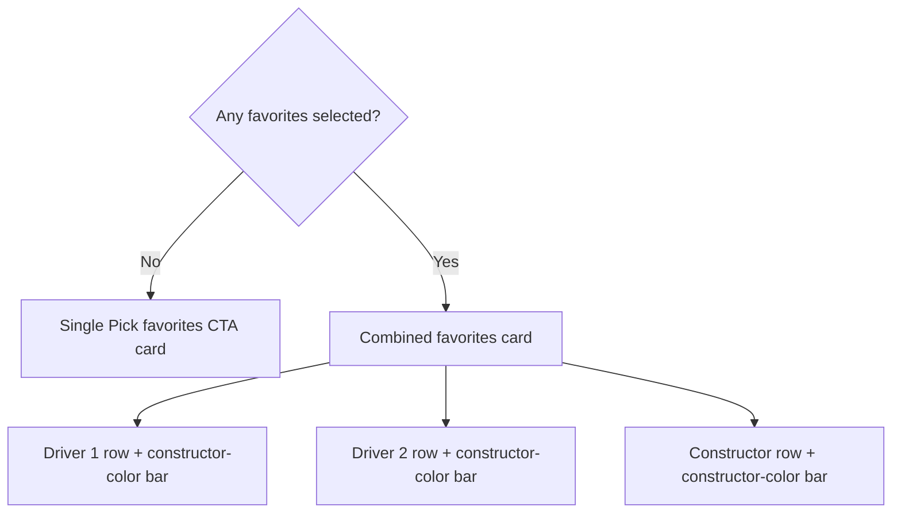

## Question

The §3 favorites section currently uses a 2-card `HorizontalPager` (`DriverCard` + `TeamCard`) with 28 lines of line-for-line layout duplication. With ticket 17's "one §1 hero, three sections total" decision, §3 needs:

- **Shape:** Pager (current) / side-by-side Row (B) / stacked cards (C) / single combined card (D)?
- **Empty state:** When no favorites are picked (default state for first launch), what does §3 render? Single "Pick favorites" CTA card / hide the section / two empty slots / something else?
- **Accent:** `TeamColors.forId` accent (from ticket 16) on a strip / on a fill / on text (token rule says backgrounds only on dark, never text)?

## The options

### Shape

| Option | Description | Tradeoff |
|---|---|---|
| A. Pager (current) | `HorizontalPager(DriverCard, TeamCard)`, swipe to switch. 2 cards, 1 visible at a time. | Compact vertically. Hides the second card behind a swipe. |
| B. Side-by-side Row | `Row { DriverEntry, TeamEntry }` with `weight = 1f` each. 2 cards visible at once, ~half the height of stacked. | Best DtS-first-timer UX. Mirrors the §3 top-speed 6dp strip pattern. Accent strips side by side. |
| C. Stacked cards | `Column { DriverCard, TeamCard }`. 2 full cards stacked. | Most accessible for a first-timer. Uses more vertical real estate (~360dp total). |
| D. Single combined card | One `Card` with two `Row`s inside: "Driver: Russell · #63" + "Team: Mercedes". | Trivially compact. Loses the team-color accent on the team card. |

### Empty state

| Option | Description | Tradeoff |
|---|---|---|
| I. Single "Pick favorites" CTA card | `Card` with "Pick your favorite driver and team" + tap → My Team picker. | Always-visible affordance. One card height. |
| II. Hide the section | Don't render §3 until `FavoritesCache` has values. | Cleanest, but the user might miss the feature. |
| III. Two empty slots | `Row { EmptyDriverSlot, EmptyTeamSlot }` with `+` icons. | Two affordances, more visual noise. |
| IV. Inline hint inside §2 or §1 | Mention favorites in the season aggregates copy. | Buries the affordance. |

### Accent (per ticket 16 — `TeamColors.forId`)

The accent is a 6dp surface strip on the leading edge of the card (mirrors the §3 top-speed `Circuits.forId(...)` pattern). On DriverEntry: the strip is the *team* color (the driver's constructor). On TeamEntry: the strip is the constructor's own color. `Color.Unspecified` returns no strip (honest unknown state, e.g. Cadillac before livery is confirmed).

## Answer

§3 uses **D: one combined card** containing three rows in fixed slot order:
Driver 1, Driver 2, Constructor. Each row has its own leading color bar. Driver
rows use that driver's constructor color; the Constructor row uses the selected
constructor's color. Colors come from `TeamColors.forId`; an unknown color omits
the bar rather than inventing a fallback.

When no favorites are selected, §3 uses **I: one “Pick favorites” CTA card**.
The CTA opens the My Team picker. The section remains visible so first-time users
can discover favorites; it does not render three noisy empty slots.

The prototype used to compare A–D was deleted after the user selected D.

## Out of scope

- Adding more slots (e.g. second team) — My Team already locks 2 drivers + 1 team.
- Cross-referencing the favorites to leaderboard or schedule surfaces.
- Favorites sync across devices — no backend in scope.
- Re-using the Q3 `Constructor` caption (tickets 20) — applies to whichever shape is chosen.

## Cross-references

- Ticket 16: `lode/wayfinder/f1app/tickets/16-team-accent-source.md` — `TeamColors.forId` is the accent source.
- Ticket 17: `lode/wayfinder/f1app/tickets/17-q1-q4-homepage-layout.md` — the §3 horizontal budget depends on the overall layout.
- Ticket 20: `lode/wayfinder/f1app/tickets/20-q3-constructor-caption.md` — the caption inside whichever shape is chosen.
- `lode/wayfinder/f1app/homepage.md` — current homepage section contract.
- `lode/wayfinder/f1app/tickets/02-homepage-section-1-and-section-3.md` (in `lode/plans/f1app-build/`) — the prior implementation shape that ticket 22 replaced.
- `lode/wayfinder/f1app/tickets/22-remaining-minor-observations.md` — item 8 implements this locked shape.
