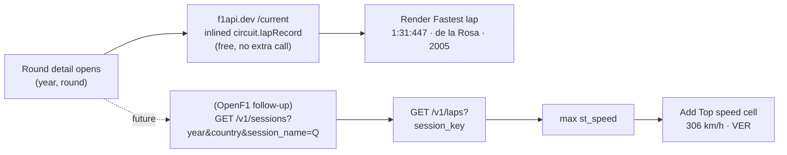
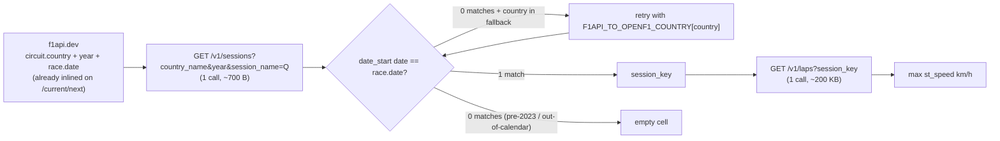

# Top-speed stat — API wrangling detail

Companion to [top-speed.md](top-speed.md). Source-by-source probes,
payload sizes, the `st_speed`-vs-`car_data` trade, and the session_key
join. This is the *how*; the *what* lives in the main file.

All probes confirmed live against the public APIs on 2026-07-16.

## f1api.dev — no speed anywhere

### `GET /circuits/{id}` (Bahrain)

```json
{
  "circuit": [{
    "circuitId": "bahrain",
    "circuitName": "Bahrain International Circuit",
    "country": "Bahrain", "city": "Sakhir",
    "circuitLength": 5412,
    "lapRecord": "1:31:447",
    "firstParticipationYear": 2004,
    "numberOfCorners": 15,
    "fastestLapDriverId": "de_la_rosa",
    "fastestLapTeamId": "mclaren",
    "fastestLapYear": 2005,
    "url": "http://en.wikipedia.org/wiki/Bahrain_International_Circuit"
  }]
}
```

`lapRecord` is a **lap-time string** (e.g. `"1:31:447"` = 1 min 31.447
sec, F1's lap-record format). No km/h, no m/s, no speed-trap
reading. The same field is inlined on the `circuit` block of every
race in `/current`, so it's already on hand for any past or upcoming
round — free.

### `GET /{year}/{round}/race` — `fastLap` is dead

The `fastLap` field exists in the schema but is **universally `null`**
across 2023 and 2024 (verified all 22 rounds × 20 drivers = 440 rows,
zero populated). Effectively deprecated. Don't promise it; don't
surface it.

### `GET /{year}/{round}/qualy`

Returns `q1/q2/q3` lap times. No speed. The qualy endpoint envelope
differs from the race endpoint (`qualyResults[]` vs `results[]`) —
locked in DTO noise per ticket 03.

**Conclusion: f1api.dev cannot serve a top-speed number, period.**
The real km/h comes from OpenF1 `/v1/laps` `st_speed` (ticket 04
reopened to multi-source). `lapRecord` may still serve a separate
"Fastest lap" cell (lap time) alongside it.

## jolpica-f1 — no speed, no lap record

```
GET https://api.jolpi.ca/ergast/f1/circuits/bahrain.json
```

```json
{
  "circuitId": "bahrain",
  "url": "http://en.wikipedia.org/wiki/Bahrain_International_Circuit",
  "circuitName": "Bahrain International Circuit",
  "Location": {
    "lat": "26.0325", "long": "50.5106",
    "locality": "Sakhir", "country": "Bahrain"
  }
}
```

No `length`, no `corners`, no `lapRecord`, no speed. Just a name and
a map pin. jolpica also serves pre-2024 history, but on the metrics
this screen needs it's strictly a subset of f1api.dev — adding
jolpica is not justified by top speed.

## Pit Lane F1 — no speed (but useful for ticket 09)

```
GET https://pitlanef1.net/api/v1/public/circuits/bahrain
```

The circuit-detail endpoint returns `records.most_wins` and
`records.winners_timeline` per circuit (useful for ticket 09
"most-wins-at-circuit", out of scope here). No `top_speed`,
`speed_trap`, or km/h field. The race endpoint
(`/api/v1/public/race/2024/1`) returns `fastest_lap_time` (a lap
time) but no speed. So Pit Lane F1 is a candidate for the
ticket-09 stat (free, pre-joined, CC-BY-4.0 with attribution) but
not for this ticket.

## OpenF1 — the only free source of real top-speed data

Two endpoints give a top-speed figure; the right one is `/v1/laps`
with `st_speed`, not the brute-force `/v1/car_data` scan.

### Endpoint A (recommended): `GET /v1/laps` — `st_speed` per lap

The **speed-trap reading**: F1's official top-speed measurement,
taken at a designated point on every lap (broadcast on TV, published
in timing sheets). It's not a peak per car over the whole race —
it's "how fast were you going at the speed trap this lap." Take the
max across all drivers and laps in the relevant session to get the
weekend's top speed.

#### Live probes (Bahrain 2024)

| Session | session_key | Rows | Rows w/ st_speed | Payload | `max(st_speed)` |
|---|---|---|---|---|---|
| Qualifying | 9468 | 384 | 375 (98%) | ~185 KB | 299 km/h (driver 4, lap 19) |
| Race | 9559 | 515 | 382 (74%) | ~236 KB | 306 km/h (driver 18) |

Sample row:
```json
{
  "driver_number": 1, "lap_number": 8, "session_key": 9161,
  "i1_speed": 307, "i2_speed": 277, "st_speed": 298,
  "duration_sector_1": 26.966, "duration_sector_2": 38.657,
  "duration_sector_3": 26.12, "lap_duration": 91.743,
  "is_pit_out_lap": false,
  "segments_sector_1": [2049, 2049, ...], ...
}
```

#### Cost to get a circuit's top speed

1. `GET /v1/sessions?year=YYYY&country_name=…&session_name=Qualifying`
   → 1 call, ~0.5 KB, returns the qualifying `session_key`.
2. `GET /v1/laps?session_key=<that key>` → 1 call, ~200 KB, all
   drivers + all laps. Take `max(lap.st_speed for lap in laps)`.

Two calls, ~200 KB total. Well inside the 3 req/s and 30 req/min
free tier (ticket-04 follow-up rate-limit headroom; verified live —
5 calls returned 200 in ~0.6 s each). Qualifying is the right
session because low-fuel push laps produce the weekend's actual top
speed; the race top speed is consistently lower and is usually the
same driver anyway.

### Endpoint B (brute): `GET /v1/car_data` — peak per driver

Per-car telemetry at ~3.7 Hz. The `speed` field is km/h; peak over
the stream = that car's session top speed. Then take max across
drivers.

#### Live probe (one driver, one race)

`session_key=9559` (Bahrain 2024 race), `driver_number=1`:
- Rows: 17,580
- Peak: 315 km/h
- Payload: ~2.8 MB (uncompressed)

#### Cost to get a circuit's top speed

1. `GET /v1/sessions?…&session_name=Race` → 1 call.
2. `GET /v1/car_data?session_key=<key>&driver_number=N` → **20
   calls (one per driver)**, each ~3 MB.
3. Per driver: `max(row.speed for row in rows)`. Take max of 20
   peaks.

21 calls, ~60 MB total. Hits the 3 req/s free-tier rate limit (21
calls at 0.33 s/call = ~7 s minimum even with no throttling). And it
answers a worse question — "what was the peak per-car telemetry
speed" is not the same as "the weekend's official speed-trap
reading." The speed trap is taken at a fixed track location; the
car-data peak is wherever the car happened to be fastest (usually
the same point, but not guaranteed). Different number, same answer
usually, but the speed trap is what F1 publishes.

This is the wrong rung. Skip unless a future need demands raw
telemetry.

## API wrangling (when the OpenF1 follow-up lands)

```
circuit_id inlined on /current race
   │
   ▼
GET /v1/sessions?year=YYYY&country_name=<country>&session_name=Qualifying
   │   (or session_name=Race for the just-finished round)
   ▼
session_key
   │
   ▼
GET /v1/laps?session_key=<key>
   │
   ▼
max(lap.st_speed for lap in laps)
   │
   ▼
(top_speed_kmh, driver_number_at_peak)
```



### Session_key join — the one real cost

**Join key is `country_name + year + race-date match`, not
`country_name` alone** (locked by ticket 11 research). f1api.dev's
`circuitId` (e.g. `"bahrain"`) is not OpenF1's key; OpenF1 identifies
circuits by `circuit_short_name` (e.g. `"Sakhir"`), `country_name`
(e.g. `"Bahrain"`), and `circuit_key` (e.g. `63`).

`country_name` alone is **not sufficient** — three countries host
multiple F1 circuits and the filter returns N sessions for the same
year:

| Country | OpenF1 `circuit_short_name` values | Affected years |
|---|---|---|
| `United States` | Austin, Las Vegas, Miami | 2023+ (3 circuits) |
| `Spain` | Catalunya, Madring | 2026+ (2 circuits) |
| `Italy` | Imola, Monza | 2023–2025 (2 circuits) |

f1api.dev's `circuit.country` already gives us the country string,
and f1api.dev's `race.schedule.race.date` (`YYYY-MM-DD`) is the
**exact race date**. OpenF1's `date_start` is ISO with time, but the
date portion matches f1api.dev's race date for every circuit tested
(Miami 2024-05-05, Austin 2024-10-20, Vegas 2024-11-24, Monza
2024-09-01, etc.). One `date_start.toLocalDate() == race.date`
comparison is unique per (year, country). Verified live.

**One country name diverges** between f1api.dev and OpenF1:
f1api.dev's `circuit.country = "Great Britain"` for Silverstone,
OpenF1's `country_name = "United Kingdom"`. This is the **only**
string divergence in the current 24-circuit schedule (verified by
enumerating all f1api.dev countries against OpenF1's `country_name`
set). 1-entry fallback map, applied only when the literal returns 0
results — same shape as the 5-entry `F1API_TO_JOLPICA_CIRCUIT` map
already in `F1Api.kt`:

```kotlin
private val F1API_TO_OPENF1_COUNTRY = mapOf(
    "Great Britain" to "United Kingdom",
)
```

`circuit_short_name` divergence (Monaco vs Monte-Carlo on OpenF1; Spa
vs Spa-Francorchamps on OpenF1) is **not a problem** because we
never use `circuit_short_name` as a join key. The date match sidesteps
it entirely. Ticket 08 originally flagged this as a risk; the
resolution is to filter by `session_name=Qualifying` (returns 1
session per meeting) and match by date, not by circuit name.

For the initial build the top-speed cell **does** need a session_key —
paid by ticket 04's reopen. Documented here so the implementation
doesn't re-derive the join.



## Coverage and limits

- **OpenF1 data range:** 2023+ (per openf1.org FAQ). A "top speed"
  cell for a 2022 or earlier round cannot be served from OpenF1; the
  lap-time cell from f1api.dev covers all-time. Fine — the OpenF1
  cell is "weekend top speed," not "circuit record," and is absent
  on pre-2023 rounds, same as the existing f1api.dev `winner` field
  is null on upcoming rounds.
- **f1api.dev `lapRecord` provenance:** Wikipedia-sourced (the
  `circuit.url` on the response is the Wikipedia article). All-time
  circuit record. Source attribution lives in the response, not in
  the app.
- **OpenF1 `st_speed` accuracy:** broadcast-grade; what F1 publishes
  in the weekend's speed-trap ranking. Same number the F1 TV
  graphics show.

## Rate-limit feel (live, 2026-07-16)

| API | 5 quick calls | Verdict |
|---|---|---|
| OpenF1 | 200 in ~0.6 s each | Comfortable. 3 req/s, 30 req/min free. `/laps` is well under. |
| f1api.dev | 200 in ~4.5 s each (cold cache) | Slower but cached. Acceptable for stat reads. |
| jolpica | 200 in ~0.3-0.7 s | Fast. 4 req/s burst, 500/hr. |

## Cross-references

- Main research file: [top-speed.md](top-speed.md) — decision,
  recommendation, invariants, lessons.
- `lode/practices.md` — HttpCache + `NO_CACHE` pull-to-refresh
  pattern. `/v1/laps` rides it.
- `lode/terminology.md` — `OpenF1`, `Wiring`, `F1Api` extension
  shape.
