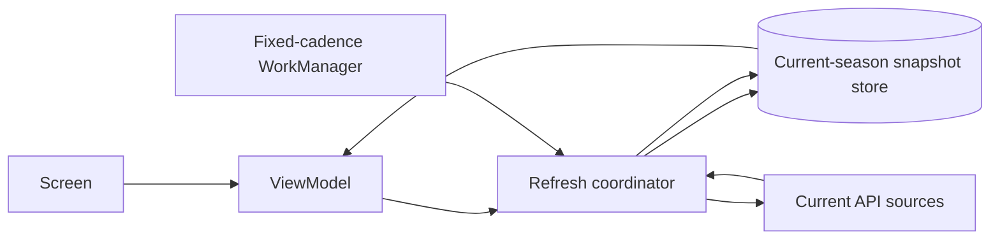

# Current-season offline data cache

## Destination

Reach an implementation-ready, user-confirmed design for F1app to render
current-season structured data from durable local storage while offline and
refresh it from the network without blanking cached content.

## Notes

- Structured API data is in scope; Coil owns remote-image caching.
- The cache retains one current-season generation through the off-season. A
  successful authoritative response stages and then promotes the next season;
  device calendar time must not clear the existing generation.
- A screen open refreshes stale data; pull-to-refresh always forces a network
  attempt. Periodic work uses a **fixed** cadence and is opportunistic, not a
  freshness guarantee.
- Cache content and sync status are separate: cached content remains visible
  during refresh or refresh failure, with a non-destructive status indicator.
- Durable storage is a Proto DataStore-style typed `CacheState.snapshots` map.
  Room `cached_resource` snapshot rows are a measured fallback only if payload
  volume, stale scans, write contention, or future indexed local queries prove
  the map substrate wrong. Fully normalized Room stays out of scope unless
  screens need local joins/sorts/filters over payload fields.
- Start each ticket with `android-offline-first`; use `jetpack-compose` and
  `kotlin-flow-state-event-modeling` for UI-state work. Existing terminology:
  `Outcome` is data-layer-only and `SectionUiState` is currently VM→UI
  transport; `HttpCache` remains under evaluation rather than being removed.

## Decisions so far

<!-- Closed-ticket index. -->

- [Cache contract and endpoint inventory](tickets/01-cache-contract-and-inventory.md) — Durable structured data uses a typed resource-snapshot cache by default; `/current` alone gates season promotion, while standings/catalogs/results refresh as follow-up resources.
- [Snapshot store shape and single-season retention](tickets/02-snapshot-store-shape-and-retention.md) — The store is one Proto DataStore-style CacheState with versioned resource snapshots; validated schedule promotion atomically flips active season and prunes old season-scoped standings, results, and catalogs.
- [Repository refresh coordination and rollover](tickets/03-repository-refresh-and-rollover.md) — Foreground refresh is per-resource, while fixed periodic background work runs a best-effort current-season bundle over the same per-resource snapshot keys, single-flight gates, and atomic schedule-gated rollover.
- [Cache-aware screen states and refresh interactions](tickets/04-cache-aware-screen-states.md) — Cache status rides on `SectionUiState.Content(data, sync)`; no-data states use full `Loading`/`Error`, while cached content stays visible through stale, refreshing, and failed-refresh states.
- [Fixed-cadence periodic sync](tickets/05-fixed-periodic-sync.md) — WorkManager runs one fixed 12-hour CONNECTED unique periodic job with TTL gates and calendar-aware current-season key selection, including only bounded recent/upcoming session resources.
- [Offline cache validation and rollout safeguards](tickets/06-offline-cache-validation.md) — Hybrid validation: JVM tests gate state, storage, coalescing, corruption, and rollover invariants; manual Android checks prove process-death/offline launch and WorkManager registration without timing assertions.
- [Storage substrate checkpoint](tickets/07-storage-substrate-checkpoint.md) — Implementation starts on Proto DataStore `CacheState.snapshots`; Room snapshot rows are reserved for measured scale/query/contention tripwires, while normalized Room remains out of scope.

## Not yet specified

<!-- The frontier is fully expressed as tickets. -->

## Out of scope

- Race-aware sync cadence — a possible later optimization; this effort uses a
  fixed periodic cadence.
- Results notifications — follow-up product effort after cache behavior is
  proven; it will decide opt-in, channels, triggers, copy, duplicate handling,
  and deep links while reusing the refresh infrastructure where appropriate.

Related: [F1app snapshot](../../summary.md), [network layer](../../core/network.md),
[practices](../../practices.md), [terminology](../../terminology.md).
