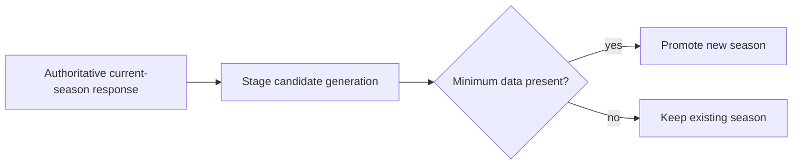
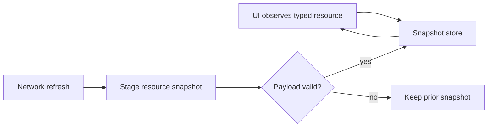

## Question

Which current-season resources and endpoint responses are durable, what is the
cache key and freshness policy for each, and which successful authoritative
response plus minimum records are sufficient to stage and promote a new season?

```kotlin
data class ResourcePolicy(
    val key: String,
    val staleAfter: Duration,
)
```



## Decision context

The scope is all structured API data rendered by supported screens, not remote
images. Per-resource freshness is expected; one global timestamp is not enough.
The old generation must survive a partial or failed new-season refresh.

Related: [map](../map.md), [network layer](../../../core/network.md).

## Answer

F1app's durable offline cache is a **typed resource-snapshot cache**, not a
Room-first relational cache. The current data is server-authored, read-only in
the app, and usually consumed as whole screen resources. `HttpCache` remains a
transport optimization; it is not the app's offline source of truth. Shared
Preferences is not fit for this because the cache needs typed payloads,
resource metadata, atomic replacement, migrations, and Flow/coroutine access.
Proto DataStore is the default candidate for the next ticket; Room stays a
fallback only if local querying, indexed partial updates, or multi-table joins
prove necessary.

```kotlin
data class CachedResource<T>(
    val key: String,
    val season: Int?,
    val payload: T,
    val fetchedAtMillis: Long,
    val staleAfterMillis: Long,
)

sealed interface CacheResourceKey {
    data class SeasonSchedule(val season: Int) : CacheResourceKey
    data class SessionResult(val season: Int, val round: Int, val session: SessionType) : CacheResourceKey
}
```



### Durable resource inventory

| Resource | Source | Key | Freshness policy | Minimum successful payload |
|---|---|---|---|---|
| Current-season schedule + aggregates | f1api.dev `/current` | `season:{year}:schedule` | stale after ~6h; foreground stale open refreshes; pull-to-refresh forces | `season` newer/equal active, non-empty `races`, at least one race with `round`, circuit id/name, and race schedule slot |
| Next race/session | f1api.dev `/current/next` plus cached schedule session choice | `season:{year}:next-race` | stale after ~30m; widget/foreground may refresh more often near sessions | success may be `null` off-season; non-null requires year, round, race name, circuit id, race date/time |
| Driver standings | Jolpica `/current/driverStandings.json` | `season:{year}:driver-standings` | stale after ~6h; manual refresh forces | standings list may be empty before standings publish; non-empty rows require driver id, position, points |
| Constructor standings | Jolpica `/current/constructorStandings.json` | `season:{year}:constructor-standings` | stale after ~6h; manual refresh forces | standings list may be empty before publish; non-empty rows require constructor id, position, points |
| Driver catalog | f1api.dev `/{year}/drivers` or `/current/drivers` | `season:{year}:drivers` | stale after ~6h | list may be partial during early season; usable rows require driver id and car number when present |
| Team catalog | f1api.dev `/current/teams` | `season:{year}:teams` | stale after ~6h | usable rows require team id and display name |
| Race result | Jolpica standard `/{year}/{round}/results.json` | `season:{year}:round:{round}:session:race` | short correction window after race, then long-lived | before results publish, empty rows are not corruption; completed cache requires at least one result row |
| Qualifying result | Jolpica standard `/{year}/{round}/qualifying.json` | `season:{year}:round:{round}:session:quali` | short correction window after session, then long-lived | same empty-before-publish rule; completed cache requires at least one row |
| FP/Sprint/Sprint Quali result | Jolpica alpha round id + `/results/{roundId}/{filter}/` | `season:{year}:round:{round}:session:{fp1|fp2|fp3|sprint|sprint-quali}` | short correction window after session, then long-lived | alpha round id must resolve; completed cache requires at least one row; car-number translation may degrade without blocking render |
| Pit-stop enrichment | Jolpica standard `/{year}/{round}/pitstops.json` | `season:{year}:round:{round}:pitstops` | correction window after race, then long-lived | empty list is valid missing enrichment |
| Circuit metadata | f1api.dev `/circuits/{id}` | `circuit:{circuitId}:metadata` | long-lived; manual refresh forces | one circuit row with id/name |
| Circuit most-wins | Jolpica `/circuits/{id}/results/1.json` | `circuit:{circuitId}:most-wins` | long-lived; manual refresh forces | P1 rows may be empty for unknown/new circuits; valid cache records total row count and nullable leaders |
| Wikipedia summary | Wikipedia REST page summary | `wiki:{title}:summary` | long-lived; manual refresh only if caller adds force support later | title + extract when present |

### Season promotion contract

Only the authoritative current-season schedule response (`/current`) can stage
and promote a new season generation. Promotion is intentionally minimal:

1. response season is greater than the active season, or there is no active
   season yet;
2. response has a non-empty race list;
3. at least one race has a round number, circuit id/name, and race schedule
   slot.

Standings, catalogs, results, and enrichment resources refresh after promotion;
they do not block it. This keeps an off-season or partially-published new season
from deleting the previous generation while avoiding a brittle "all resources
must be present" gate.

### Freshness rule

TTL values are app policy, not blind copies of HTTP headers. Upstream headers
observed during planning were f1api.dev `max-age=30` for `/current/next`,
f1api.dev `max-age=600` for current schedule/catalog endpoints, and Jolpica
standard `max-age=3600` for standings/results. The durable cache can use longer
screen-level TTLs because foreground stale opens and pull-to-refresh still try
the network without blanking cached content.
