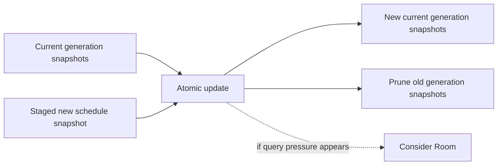
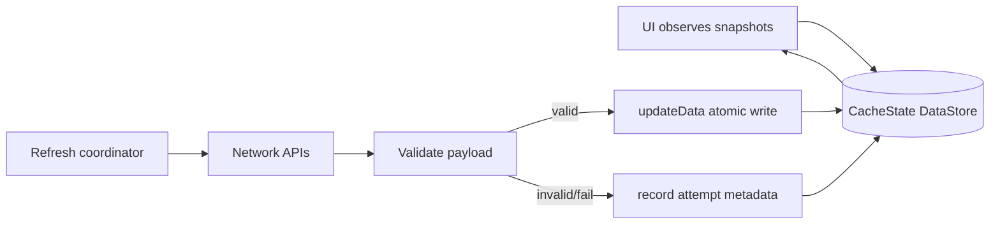
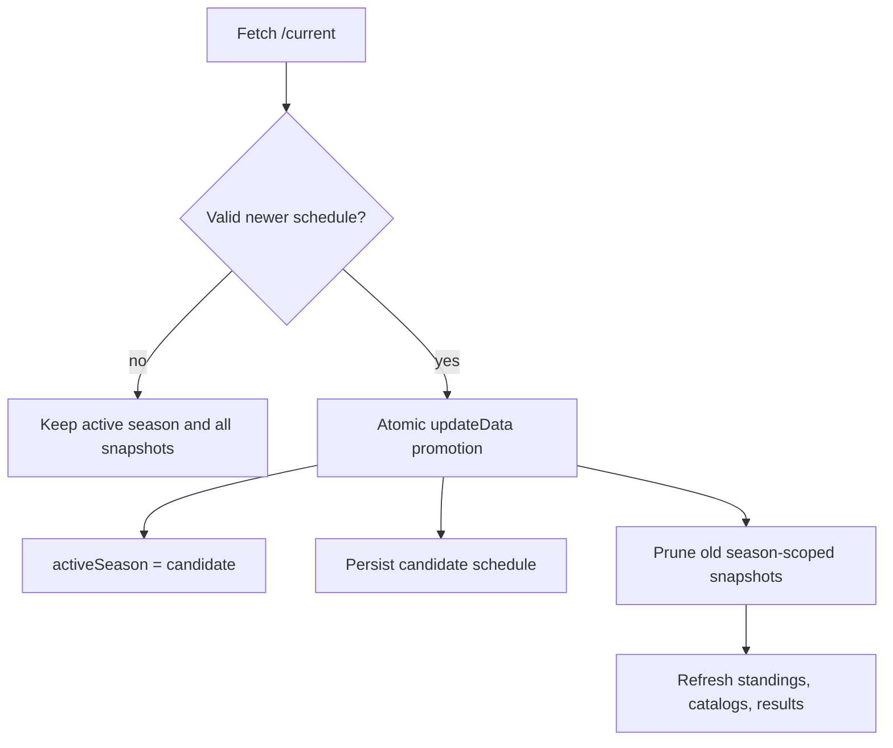

## Question

How should a Proto DataStore-style resource snapshot store represent the
approved resource inventory, season generation, sync metadata, migrations,
atomic promotion, and pruning so the UI has one durable source of truth without
retaining a historical archive; and what evidence would justify switching to
Room instead?

```kotlin
data class ResourceEnvelope(
    val key: String,
    val season: Int?,
    val payloadJson: String,
    val fetchedAtEpochMs: Long,
    val staleAfterEpochMs: Long,
)
```



## Decision context

Ticket 01 rejected a Room-first assumption. The cache is mostly whole-resource,
server-authored structured data, so Proto DataStore is the default candidate.
Room is considered only if this ticket proves the app needs relational queries,
indexed partial updates, or join-heavy local reads that would make snapshot
reads awkward or unsafe.

Related: [Cache contract and endpoint inventory](01-cache-contract-and-inventory.md),
[map](../map.md).


## Answer

The offline structured-data cache uses a **single-season typed snapshot store**.
The default implementation target is one Proto DataStore-style `CacheState` file
with typed envelopes and versioned serialized payloads, not Room. The envelope is
typed and migratable; each resource payload can still use kotlinx serialization
behind a `payloadKind` + `payloadVersion` boundary so resource-shape migrations
stay local.

Current implementation status: the snapshot envelope and single-season retention
contract remain accepted, but the storage substrate is not final. Ticket 07
re-checks whether this envelope should live in a Proto DataStore map or a single
Room `cached_resource` snapshot table before implementation starts.

```kotlin
data class CacheState(
    val schemaVersion: Int,
    val activeSeason: Int?,
    val snapshots: Map<String, ResourceSnapshot>,
)

data class ResourceSnapshot(
    val key: String,
    val season: Int?,
    val payloadKind: String,
    val payloadVersion: Int,
    val payloadJson: String,
    val fetchedAtEpochMs: Long,
    val staleAfterEpochMs: Long,
    val lastAttemptEpochMs: Long?,
    val lastAttemptStatus: RefreshAttemptStatus?,
)

enum class RefreshAttemptStatus { Success, NetworkFailure, InvalidPayload }
```

The store is the durable source of truth for structured API data. `HttpCache`
remains a transport optimization under the Ktor client; it is not consulted by
the UI as durable app state and cannot satisfy offline screen state contracts by
itself.



### Key and envelope contract

Each durable resource has one stable cache key from ticket 01. Season-scoped
keys include the season in both the key string and the snapshot metadata:

```kotlin
sealed interface CacheResourceKey {
    data class SeasonSchedule(val season: Int) : CacheResourceKey
    data class DriverStandings(val season: Int) : CacheResourceKey
    data class TeamCatalog(val season: Int) : CacheResourceKey
    data class SessionResult(
        val season: Int,
        val round: Int,
        val session: SessionType,
    ) : CacheResourceKey
    data class CircuitMetadata(val circuitId: String) : CacheResourceKey
}
```

Catalogs are season-scoped reference lists: drivers, teams/constructors, and
other lookup data used for detail joins and the Jolpica alpha car-number bridge.
They are not standings. They still prune on rollover because drivers can change
teams and constructors can enter, leave, or rename between seasons.

`lastAttempt*` metadata is separate from the last good payload. A failed refresh
must never erase cached content; it records that a refresh was attempted and why
it failed, while readers continue to get the previous valid snapshot plus stale
metadata.

### Single-season retention and promotion

Only a validated f1api.dev `/current` schedule response may promote a new active
season. The promotion write is atomic:

1. validate candidate schedule using ticket 01's minimum payload contract;
2. `updateData` sets `activeSeason = candidateSeason`;
3. write the new schedule snapshot;
4. prune every season-scoped snapshot whose `season != activeSeason`.



There is no cross-season fallback after promotion. Old standings, session
results, driver catalogs, and team catalogs are removed immediately rather than
shown under the new active season. Missing new-season dependent resources render
as unavailable/stale-not-yet-refreshed states until their own refresh succeeds.
Non-season resources, such as circuit metadata, circuit most-wins, and Wikipedia
summaries, can remain because they are keyed independently of the active season.

### Migration contract

The store starts with `schemaVersion = 1`, `activeSeason = null`,
an empty `snapshots` map, and no durable staged season. The candidate schedule is staged only in memory during validation and then promoted in one `updateData` call; v1 does not persist a staged season field. Future migrations advance
`schemaVersion` and either transform compatible payload envelopes or drop only
the incompatible resource snapshot. A migration must not fabricate fresh content
or silently reinterpret a payload under a different `payloadKind`.

### Room fallback evidence

Room becomes the right store only with evidence that snapshots are the wrong
access pattern. The switching evidence is one of:

- local reads need indexed queries, relational joins, or filtered subsets across
  many rows;
- refreshes need safe partial updates to large resources instead of whole-resource
  replacement;
- DataStore whole-file read/write cost becomes material because cached session
  results and enrichment payloads grow into an unbounded blob;
- tests or traces show write contention from frequent independent resource
  updates.

Absent that evidence, Room would add schema, DAO, and migration surface without
matching the app's mostly whole-resource, server-authored data shape.

### Validation required before implementation is called ready

The implementation should prove these invariants with fakes or unit tests:

- valid schedule promotion is atomic and prunes old season-scoped snapshots;
- invalid or failed candidate schedule keeps the old active season and snapshots;
- failed refresh preserves the last good payload and updates only attempt metadata;
- stale decisions use `staleAfterEpochMs`, not `fetchedAtEpochMs` alone;
- empty store migration initializes a valid `CacheState`;
- readers never return previous-season standings, results, or catalogs after a
  new active season is promoted.
