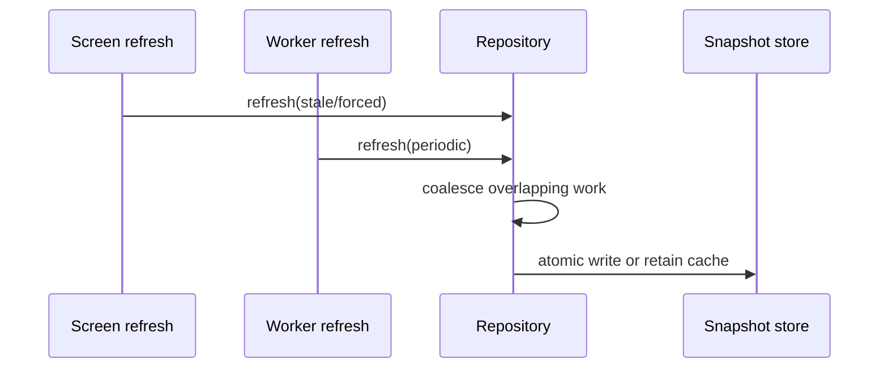
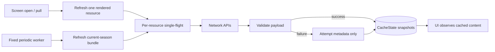

## Question

What repository contract makes the durable snapshot store the UI source of
truth, coordinates foreground and worker refreshes as one single-flight
operation, applies the server-wins rule, promotes a staged new season
atomically, and preserves cached content on failure?

```kotlin
interface SeasonCacheRepository {
    fun observeSeason(): Flow<Season?>
    suspend fun refresh(reason: RefreshReason): RefreshResult
}
```



## Decision context

There are no client edits to API-backed F1 data, so remote data wins. A failed
network refresh is status information, not a reason to delete a valid cache.
The role of the existing Ktor `HttpCache` needs an explicit compatibility
decision rather than an assumed removal.

Related: [Snapshot store shape and single-season retention](02-snapshot-store-shape-and-retention.md),
[map](../map.md).

## Answer

Foreground and background refresh use different orchestration shapes while
sharing the same durable snapshot store. Foreground refresh is **per-resource**:
a screen observes the resource snapshots it renders and refreshes only those
resources when they are stale or explicitly pulled. Background refresh is a
**current-season bundle job**: fixed periodic work attempts the known current
season resources as a batch so the app is warm before the user opens it. The
bundle is orchestration only; each resource still has its own cache key,
metadata, validation, and failure boundary.

```kotlin
interface SeasonCacheRepository {
    fun observeSeason(): Flow<CachedResource<Season>?>
    fun observeDriverStandings(): Flow<CachedResource<List<DriverStanding>>?>

    suspend fun refresh(resource: CacheResourceKey, reason: RefreshReason): RefreshResult
    suspend fun refreshCurrentSeasonBundle(reason: RefreshReason.Periodic): BundleRefreshResult
}

sealed interface RefreshReason {
    data object StaleOpen : RefreshReason
    data object PullToRefresh : RefreshReason
    data object Periodic : RefreshReason
}
```



The UI source of truth is always the snapshot store. Refresh calls return
status, not payload, so screens cannot accidentally render a transient network
response that was not promoted into durable state. `Outcome` remains a data-layer
transport for existing use cases until implementation migrates them; the offline
cache contract should expose snapshot content plus refresh metadata to the
ViewModel, then the ViewModel maps that into `SectionUiState`.

### Foreground per-resource contract

A screen refreshes only what it renders. Homepage can refresh schedule, next
race, standings, and favorites-related standings independently; Leaderboard
refreshes standings; Round detail refreshes its season schedule and session
resources; Session Result refreshes only the selected session and enrichment. A
failed resource refresh updates `lastAttempt*` metadata and leaves the last good
payload visible. Pull-to-refresh sets `forceRefresh` semantics for those
rendered resources: it bypasses TTL and sends `Cache-Control: no-cache`, but it
still writes through the snapshot store and does not clear existing content.

### Background bundle contract

The worker performs a best-effort **current-season bundle refresh** on a fixed
cadence. The bundle boundary is the current-season structured data needed to
open supported app surfaces warm: active schedule, next-race/session, driver and
constructor standings, season driver/team catalogs, and recently completed or
soon-upcoming session resources/enrichment known from the active schedule.
Ticket 05 may refine ordering, cadence, and the exact “recent/upcoming” window,
but it must not expand the bundle into historical archives or remote-image
caching. The bundle result is partial by design: one failed resource does not
fail or roll back successful resource writes, and it never deletes cached
content. The worker records per-resource attempt metadata plus an aggregate
bundle summary for diagnostics.

### Single-flight and overlap

Foreground and worker refreshes coalesce through one per-resource single-flight
gate. If the worker is already refreshing driver standings and the Leaderboard
opens, the Leaderboard joins that in-flight resource refresh rather than
starting a duplicate call. A foreground pull-to-refresh may supersede only a
queued/stale-policy attempt that has not started the network call; once a
network call is running, the foreground joins it and observes the durable write
when it lands.

```kotlin
class RefreshCoordinator(
    private val store: SnapshotStore,
    private val api: CurrentSeasonApi,
) {
    private val gates = mutableMapOf<CacheResourceKey, Deferred<RefreshResult>>()

    suspend fun refresh(key: CacheResourceKey, reason: RefreshReason): RefreshResult =
        singleFlight(key) {
            val remote = api.fetch(key, forceRefresh = reason is RefreshReason.PullToRefresh)
            store.updateResource(key, remote) // server wins on valid payload
        }

    suspend fun refreshCurrentSeasonBundle(): BundleRefreshResult =
        currentSeasonKeys().map { key -> key to refresh(key, RefreshReason.Periodic) }
            .toBundleResult()
}
```

### Rollover transaction

`/current` schedule remains the only promotion authority. When either a
foreground schedule refresh or the background bundle receives a valid newer
schedule, the repository performs one atomic store update: set `activeSeason`,
write the schedule snapshot, and prune season-scoped snapshots from the previous
season. The background bundle may then continue with new-season standings and
catalog refreshes, but those follow-up resources do not block promotion. If the
new schedule is invalid or the network fails, the active season and all previous
snapshots remain unchanged except for attempt metadata.

`HttpCache` stays below this contract as a Ktor transport optimization. It can
reduce network cost for both foreground and worker refreshes, but it is not the
offline data source and is bypassed only by explicit force refresh.

