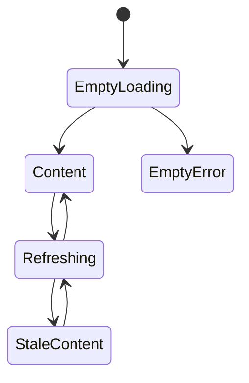
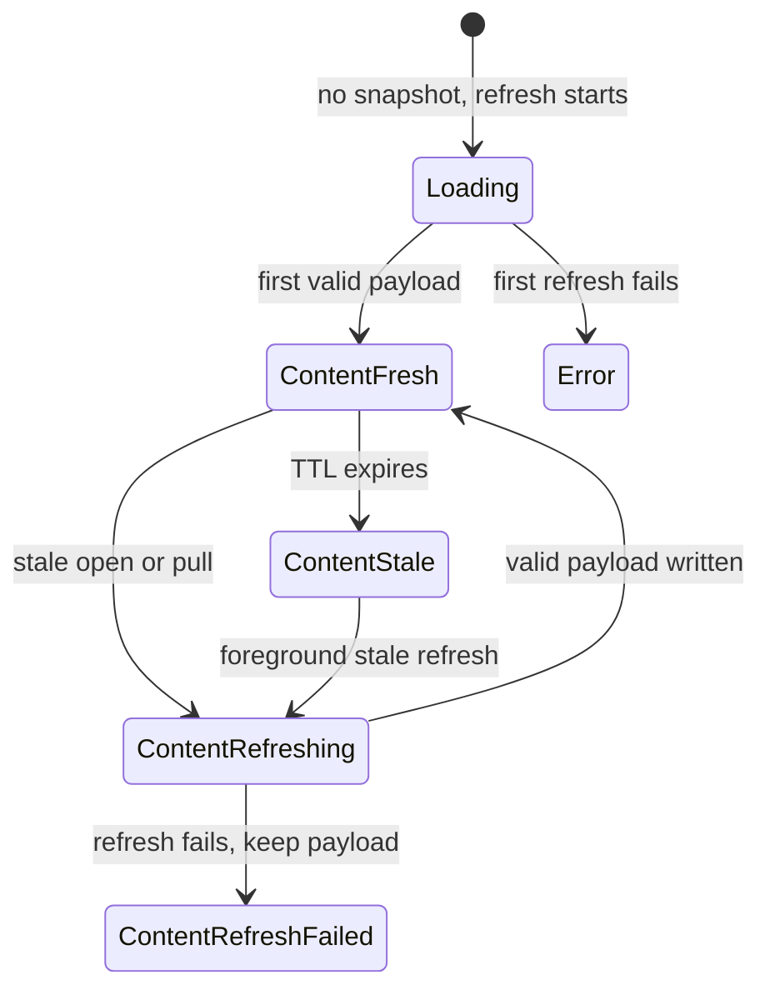

## Question

How should ViewModels and composables distinguish no-data loading/error from
cached content that is refreshing, stale, or failed to refresh, while keeping
the existing `Outcome` and `SectionUiState` layer boundary coherent?

```kotlin
data class CachedContent<T>(
    val data: T,
    val sync: SyncStatus,
)
```



## Decision context

Screen open must refresh only when its resource is stale. Pull-to-refresh must
always attempt the network. Neither a spinner nor a failed refresh may blank
already-rendered cached content.

Related: [Repository refresh coordination and rollover](03-repository-refresh-and-rollover.md),
[terminology](../../../terminology.md), [map](../map.md).


## Answer

Cache awareness belongs on `SectionUiState.Content` itself. Screens continue to
receive the real render data as `content.data`, while refresh/stale/failure
metadata rides beside it as `content.sync`. This keeps existing UI code close to
its current shape and avoids wrapping every cached value in a second
`CachedContent<T>` domain object.

```kotlin
sealed interface SectionUiState<out T> {
    data object Loading : SectionUiState<Nothing>
    data class Error(val message: String) : SectionUiState<Nothing>
    data class Content<T>(
        val data: T,
        val sync: ContentSyncStatus = ContentSyncStatus.Fresh,
    ) : SectionUiState<T>
}

sealed interface ContentSyncStatus {
    data object Fresh : ContentSyncStatus
    data object Refreshing : ContentSyncStatus
    data object Stale : ContentSyncStatus
    data class RefreshFailed(val message: String) : ContentSyncStatus
}
```

The state split is simple:

- no cached payload yet + refresh running → `Loading`;
- no cached payload yet + refresh failed → `Error(message)`;
- cached payload exists → `Content(data, sync)` for every fresh, refreshing,
  stale, or refresh-failed state.

A refresh failure never turns `Content` into `Error`; it becomes
`Content(data, ContentSyncStatus.RefreshFailed(message))`. A stale open can show
`Content(data, Stale)` first, then `Content(data, Refreshing)` while the
repository attempts the stale refresh, and then either fresh content or the
same data with a failed-refresh marker.



`Outcome` remains data-layer-only. Repository/cache observation exposes payload
plus snapshot metadata; ViewModels map that into `SectionUiState`. Existing
`Outcome.toSection()` can keep mapping old non-cache use cases to
`Content(data, Fresh)`, so adoption can be incremental.

Pull-to-refresh indicators should read `ContentSyncStatus.Refreshing`, not only
`SectionUiState.Loading`. Full-section loading spinners are reserved for the
empty/no-data phase. Status UI is intentionally non-destructive: small stale
copy, a refresh indicator, snackbar, or inline warning may accompany content,
but cached content stays visible.

Automated tests should assert behavior by state phase rather than exact old
`Content(data)` equality. Existing exact equality tests need a defaulted
`sync = Fresh` expectation or should assert `content.data` and `content.sync`
separately.
