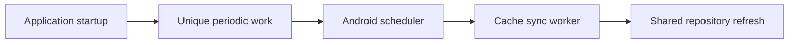
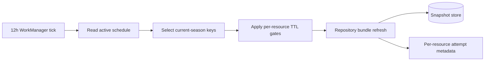

## Question

What fixed WorkManager interval, constraints, retry policy, startup scheduling,
and resource selection warm the cache responsibly while sharing the repository
refresh path and accepting Android's inexact execution model?

```kotlin
val request = PeriodicWorkRequestBuilder<CacheSyncWorker>(interval)
    .setConstraints(networkConnectedConstraints)
    .build()
```



## Decision context

The user selected a fixed cadence because racing-weekend users also open the
app frequently. Periodic work improves warm-cache odds but screen-open refresh
is the mandatory freshness path.

Related: [Repository refresh coordination and rollover](03-repository-refresh-and-rollover.md),
[map](../map.md).

## Answer

Periodic cache sync uses **one fixed 12-hour WorkManager cadence** with
calendar-aware resource selection, not dynamic race-weekend rescheduling. App
open and pull-to-refresh remain the freshness guarantees; periodic work only
improves the odds that current-season data is already warm when the user opens
F1app offline.

```kotlin
private const val CACHE_SYNC_WORK = "current-season-cache-sync"

val request = PeriodicWorkRequestBuilder<CacheSyncWorker>(12, TimeUnit.HOURS)
    .setConstraints(
        Constraints.Builder()
            .setRequiredNetworkType(NetworkType.CONNECTED)
            .build()
    )
    .setBackoffCriteria(BackoffPolicy.EXPONENTIAL, 30, TimeUnit.SECONDS)
    .build()

WorkManager.getInstance(context).enqueueUniquePeriodicWork(
    CACHE_SYNC_WORK,
    ExistingPeriodicWorkPolicy.KEEP,
    request,
)
```



The worker is enqueued at application startup with `KEEP`. Startup does not run
an immediate one-time sync because screen-open refresh already owns freshness.
`KEEP` is intentional for a stable v1 policy; if a later release changes the
interval or constraints, implementation must use `UPDATE` or a versioned unique
work name because `KEEP` will not mutate already-enqueued periodic work.

### Resource selection

The worker shares the repository's `refreshCurrentSeasonBundle()` path and the
same per-resource single-flight gates as foreground refresh. The 12-hour tick
only decides which keys are worth considering; normal TTL/staleness gates still
decide whether a network call runs.

The bundle considers:

1. active/current schedule as cached key discovery and the only rollover guard;
2. next session/race;
3. driver and constructor standings;
4. current driver/team catalogs;
5. session result and enrichment keys for sessions whose scheduled start is in
   the bounded window `now - 48h` through `now + 48h`.

Session-scoped resource discovery may include upcoming sessions, but result
endpoints are refreshed only once the session is plausibly complete according to
the repository's completion/staleness rules. This avoids noisy pre-session
404/empty-result attempts while still warming race-weekend results and standings
without a historical archive sweep.

```kotlin
fun currentSeasonBundleKeys(now: Instant, schedule: Season): List<CacheResourceKey> =
    buildList {
        add(CacheResourceKey.SeasonSchedule(schedule.year))
        add(CacheResourceKey.NextRace(schedule.year))
        add(CacheResourceKey.DriverStandings(schedule.year))
        add(CacheResourceKey.ConstructorStandings(schedule.year))
        add(CacheResourceKey.DriverCatalog(schedule.year))
        add(CacheResourceKey.TeamCatalog(schedule.year))
        addAll(schedule.sessionsNear(now, before = 48.hours, after = 48.hours)
            .filter { it.isPlausiblyComplete(now) }
            .flatMap { it.resultAndEnrichmentKeys() })
    }
```

### Worker result policy

Per-resource failures are normal for a best-effort bundle. A failed standings,
catalog, or result refresh writes attempt metadata, preserves the last good
payload, and does not fail the whole worker. The worker returns retry only when
the bundle cannot run at all due a transient infrastructure failure such as no
usable repository wiring, store I/O failure before resource attempts, or a
network/server outage that prevents every attempted resource from reaching its
normal per-resource failure boundary.
