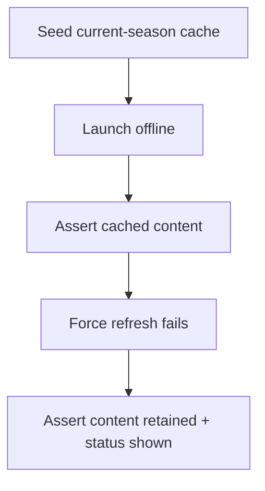
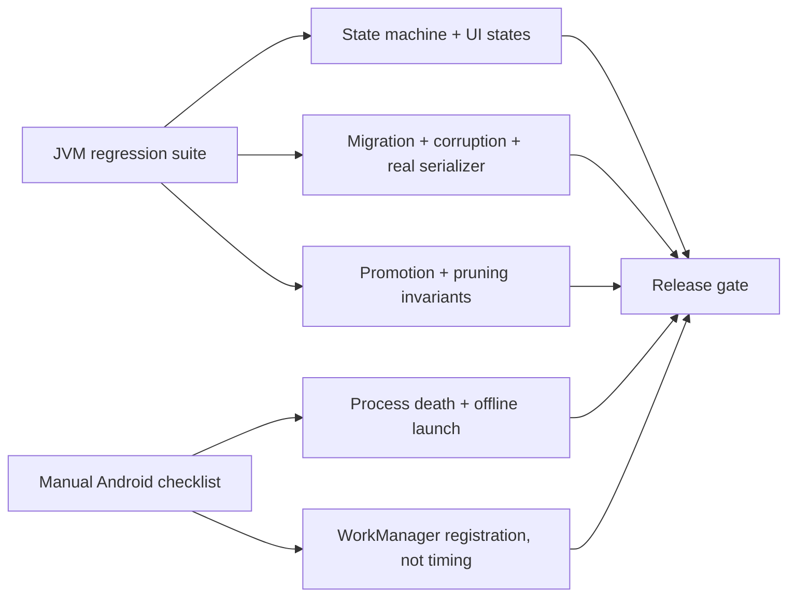

## Question

What automated and manual verification proves the cache survives process death
and offline launch, preserves content after failed forced refresh, migrates
safely, handles corrupt storage, coalesces concurrent worker/UI refreshes, and
promotes a partially available new season without losing the old one?

```kotlin
@Test
fun refreshFailure_keepsCachedContentVisible() = runTest {
    // seed snapshot store, fail network refresh, assert observed content remains
}
```



## Decision context

Validation must include database migration and rollback behavior as well as
screen behavior. WorkManager execution timing itself cannot be asserted as a
precise clock guarantee.

Related: [Cache-aware screen states and refresh interactions](04-cache-aware-screen-states.md),
[Fixed-cadence periodic sync](05-fixed-periodic-sync.md), [map](../map.md).

## Answer

Validation uses a **hybrid** gate: JVM tests carry the regression load, while a
short Android/manual checklist proves the platform behaviors that pure JVM tests
cannot faithfully simulate.

Automated tests are required for the cache state machine and UI-state mapping:
seeded cache survives repository recreation, stale cached content maps to
`SectionUiState.Content(data, Stale)`, refresh-in-progress preserves content as
`Refreshing`, forced foreground refresh failure preserves content as
`RefreshFailed`, background bundle failure updates attempt metadata without
blanking content, and concurrent worker/UI refreshes coalesce through the
per-resource single-flight gate. These tests use fakes over interaction mocks
and assert emitted outcomes, not internal call counts.

Storage safety gets its own automated set: schema-version migration tests,
corrupt-store tests, deterministic clock/network injection, and at least one
temp-file test using the real serializer/store path instead of only an in-memory
fake. A corrupt cache must not crash the app; it is treated as no usable cached
payload, logged/telemetried best-effort, and recoverable by a later successful
refresh overwriting or quarantining the bad state. Unsupported future schemas
and failed migrations fail safe the same way: preserve or quarantine old bytes
where possible, expose no usable cache, and allow network recovery.

Season rollover tests are release blockers. Partial next-season resources never
promote or prune the old generation. Only a validated authoritative `/current`
schedule can atomically promote `activeSeason`, write the new schedule snapshot,
and prune old season-scoped standings, catalogs, and results. Failed promotion
leaves the previous active season readable and retryable.

Manual/platform validation covers true process death, offline launch, and
WorkManager registration: seed the app online, force-stop/kill it, disable
network or enable airplane mode, relaunch, and confirm cached current-season
surfaces render before any network success. WorkManager validation asserts the
unique periodic job name, `CONNECTED` constraint, 12-hour interval, startup
`KEEP` behavior, and separation from pull-to-refresh; it never asserts exact
run timing.

```kotlin
@Test
fun forcedRefreshFailure_keepsCachedContentVisible() = runTest {
    store.writeSnapshot(seasonKey, cachedSeason, staleAfter = past)
    api.failNextRefresh(IOException("offline"))

    viewModel.refresh(force = true)

    assertEquals(
        SectionUiState.Content(cachedSeason, ContentSyncStatus.RefreshFailed("offline")),
        viewModel.season.value,
    )
}
```


