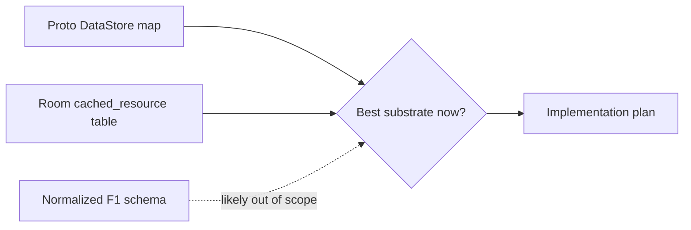
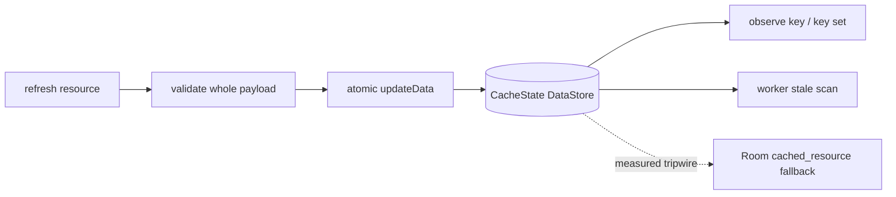

## Question

Before implementation starts, should the durable structured-data cache use the
current Proto DataStore `CacheState.snapshots` map plan, or switch to a single
Room `cached_resource` snapshot table while still avoiding a fully normalized F1
domain schema?

```kotlin
@Entity(tableName = "cached_resource")
data class CachedResourceEntity(
    @PrimaryKey val key: String,
    val resourceType: String,
    val season: Int?,
    val round: Int?,
    val sessionType: String?,
    val staleAfterEpochMs: Long,
    val payloadKind: String,
    val payloadVersion: Int,
    val payloadJson: String,
)
```



## Decision context

Ticket 02 chose Proto DataStore as the default because the cache was framed as
bounded whole-resource snapshots. Later tickets made per-resource TTL metadata,
season-scoped pruning, worker stale-resource selection, foreground subset
observation, and single-flight resource coordination core to the plan. Those
requirements may justify SQLite rows without committing to a normalized domain
schema.

Compare three options:

- Proto DataStore `CacheState` map;
- Room `cached_resource` snapshot table;
- fully normalized Room domain model.

The checkpoint should use concrete expected resource count, payload sizes,
stale-selection queries, pruning operations, observation granularity, write
contention risk, debugging ergonomics, migration complexity, and KMP extraction
cost. Fully normalized Room remains out of scope unless screens need local joins,
sorting, or filtering over fields inside payloads.

Related: [Snapshot store shape and single-season retention](02-snapshot-store-shape-and-retention.md),
[Offline cache validation and rollout safeguards](06-offline-cache-validation.md),
[map](../map.md).

## Answer

Use the **Proto DataStore-style typed `CacheState.snapshots` map** for the
offline structured-data cache implementation. Room remains a measured fallback,
not the starting substrate, and a fully normalized Room F1 domain schema stays
out of scope.

The current cache is bounded, current-season, and whole-resource oriented:
schedule/next-session, standings, catalogs, recent/upcoming session results and
enrichment, circuit metadata, circuit most-wins, and Wikipedia summaries. The
UI does not need indexed local joins, sorting, or filtering over fields inside
payloads; it observes typed resource snapshots and renders deserialized whole
payloads. Under that shape, Room would add schema, DAO, query, and migration
surface before the app has evidence that SQLite rows solve a real access-pattern
problem.

```kotlin
data class CacheState(
    val schemaVersion: Int,
    val activeSeason: Int?,
    val snapshots: Map<String, ResourceSnapshot>,
)

data class ResourceSnapshot(
    val key: String,
    val season: Int?,
    val payloadKind: String,
    val payloadVersion: Int,
    val payloadJson: String,
    val fetchedAtEpochMs: Long,
    val staleAfterEpochMs: Long,
    val lastAttemptEpochMs: Long?,
    val lastAttemptStatus: RefreshAttemptStatus?,
)
```

Expected scale is still small enough for whole-file map scans and atomic writes:
one active season schedule, one next-session resource, two standings resources,
two catalogs, bounded race-weekend session resources selected around `now - 48h`
through `now + 48h`, plus long-lived circuit/wiki resources. Worker stale-key
selection may scan the map in memory. Foreground subset observation may observe
the whole DataStore flow and map/filter to the requested key; this means any
store write can wake observers, so implementation should use stable equality and
`distinctUntilChanged` at the observed resource seam to avoid unnecessary UI
state churn.



Room's `cached_resource` table becomes warranted only with evidence that the
DataStore snapshot map is the wrong substrate. Tripwires are:

- serialized cache file size grows into multi-megabyte territory from broadened
  result/enrichment retention;
- temp-file tests or traces show schedule promotion, pruning, stale scans, or
  ordinary resource writes taking long enough to affect screen open or worker
  reliability on representative devices;
- foreground plus worker refreshes show material DataStore write contention
  despite per-resource single-flight gates;
- future screens require indexed queries, relational joins, sorting, filtering,
  or partial updates across fields inside payloads;
- debugging or migration burden of a single blob becomes worse than Room's DAO
  and migration surface.

The implementation validation gate must include temp-file tests over the real
serializer/store path for atomic promotion/pruning, stale-key selection,
resource observation emissions, failed-refresh metadata preservation, schema
migration, and corruption recovery. Corruption still fails safe as no usable
cached payload, with best-effort quarantine/diagnostics and later network
recovery.
